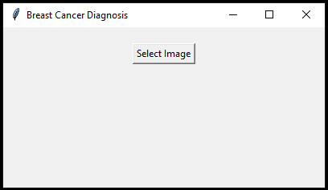
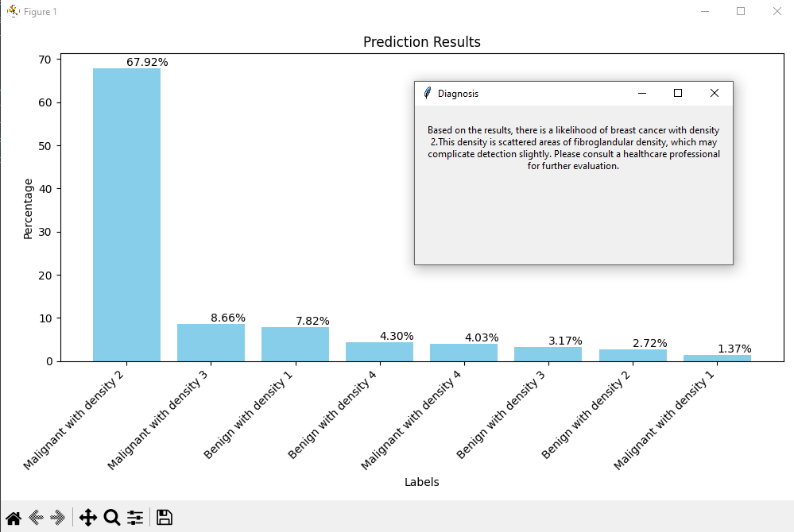

# Breast Cancer Detection

## Overview
This project is a Breast Cancer Detection tool built using Machine Learning and Deep Learning techniques. It leverages **TensorFlow**, **OpenCV**, **Tkinter**, and **Python** to create a reliable, user-friendly interface for detecting breast cancer from medical imaging data. The application serves as a potential aid for medical professionals by providing early detection capabilities, improving diagnostic accuracy.

## How It Works

## Skills
- **Machine Learning**
- **Deep Learning**
- **Python**
- **TensorFlow**
- **OpenCV**
- **Tkinter**
- **Computer Vision**
- **Artificial Intelligence**
- **Tkinter**

## How to Use
1. **Clone the Repository**:
    `git clone [https://github.com/yourusername/breast-cancer-detection.git](https://github.com/Kabir-Sidhu/Breast-Cancer-Detection)`

2. **Download Model Weights**:
    Download the pre-trained model and weights from [Google Drive](https://drive.google.com/file/d/1sMbvTuQ5-DnFXnLMkTt1wx2xcIpqPkXu/view?usp=sharing).
    Place the downloaded file in the `./model` directory within the cloned repository.

3. **Install Dependencies**:
    `pip install tensorflow opencv-python matplotlib`

4. **Run the Application**:
    `python main.py`

## Contributing
Contributions are welcome! Please create a new branch for any feature or bug fixes and submit a pull request with your changes.
